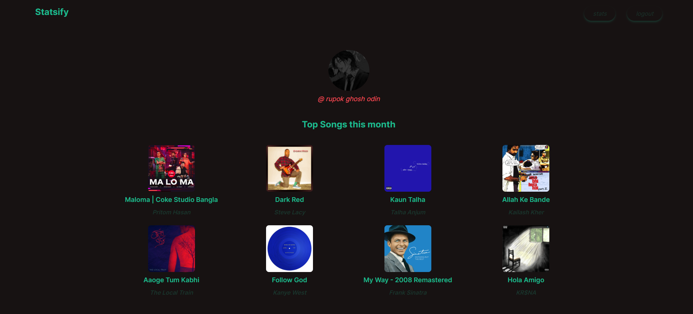

# Statsify

Statsify is a web application that provides users with statistics and insights into their Spotify listening habits.



## Features

- **User Authentication**: Secure login with Spotify.
- **Personalized Stats**: View your top tracks, artists, genres, and more.
- **Responsive Design**: Optimized for both desktop and mobile devices.
- **User Testimonials**: See what others are saying about Statsify.

## Tech Stack

- **Framework**: [Next.js](https://nextjs.org/)
- **Styling**: [Daisy UI](https://daisyui.com/)
- **Authentication**: [NextAuth.js](https://next-auth.js.org/)
- **API**: [Spotify Web API](https://developer.spotify.com/documentation/web-api/)

## Contributing

We welcome contributions to Statsify! To contribute, follow these steps:

1. **Fork the repository**.
2. **Create a new branch**:
   ```bash
   git checkout -b feature/your-feature-name
   ```
3. **Make your changes**.
4. **Commit your changes**:
   ```bash
   git commit -m 'Add some feature'
   ```
5. **Push to the branch**:
   ```bash
   git push origin feature/your-feature-name
   ```
6. **Open a pull request**.
